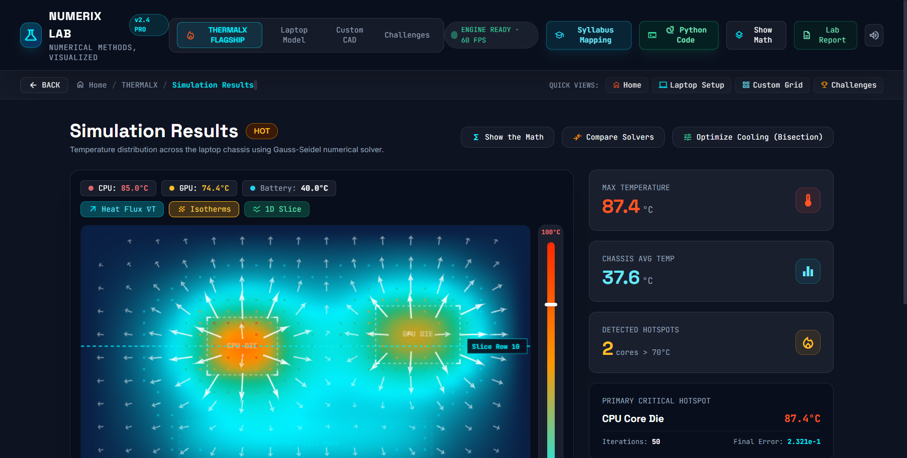
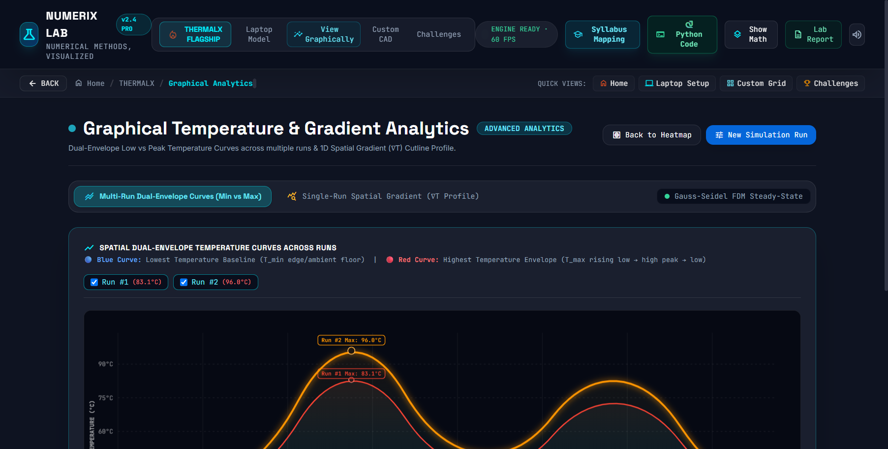
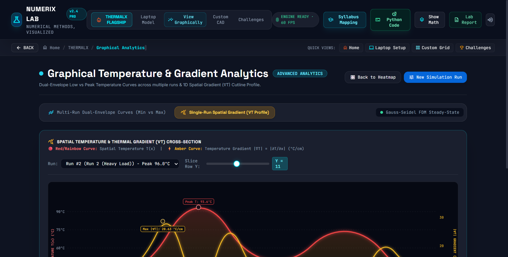
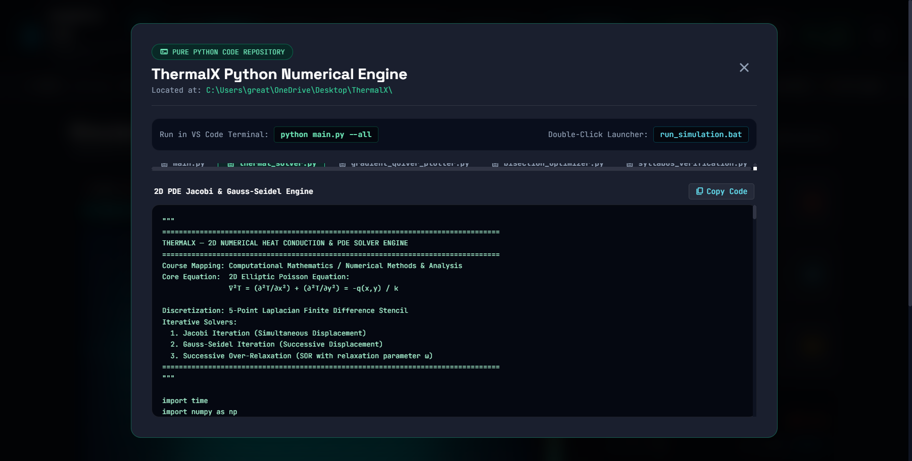

# 🔥 ThermalX — 2D Semiconductor Thermal Conduction & PDE Simulator

[](https://www.python.org/)
[](https://github.com/greatrocktiger-byte/ThermalX)
[](LICENSE)
[](https://github.com/greatrocktiger-byte/ThermalX)

> **ThermalX** is a flagship computational engineering application that solves the **2D Steady-State Heat Conduction Equation (Poisson & Laplace PDEs)** across high-power semiconductor packages (x86 CPU, Discrete GPU, and Li-Ion Battery dies). It unifies an interactive cybernetic web visualizer with a pure Python numerical analysis suite.

---

## 📸 Visual Showcase

### 1. Live Web Simulation & Heat Flux Quiver Vectors


### 2. Multi-Run Dual-Envelope Curves (Min Baseline vs Max Thermal Envelope)

> **Blue Curve:** Lowest temperature floor ($T_{\min}$) across edge cooling vents.  
> **Red Curve:** Highest temperature transition envelope ($T_{\max}$), rising from cold boundary to peak core and descending back down (Low $\rightarrow$ High $\rightarrow$ Low).

### 3. Single-Run In-Depth Spatial Gradient ($|\nabla T|$) & Cutline Profile

> **Red Curve:** Continuous temperature distribution $T(x)$.  
> **Amber Curve:** Spatial temperature gradient $|\nabla T(x)| = |\frac{\partial T}{\partial x}|$ in $^\circ\text{C}/\text{cm}$, exposing maximum thermal stress at the die-substrate interface.

### 4. Integrated Python Code Inspector


---

## 🎓 University Syllabus Mapping

This project maps directly into the standard **Computational Mathematics / Numerical Methods & Analysis** curriculum:

| Syllabus Unit | Mathematical Formulation | ThermalX Implementation |
|---|---|---|
| **2D Elliptic PDEs** | Poisson Equation: $\nabla^2 T = -\frac{q(x,y)}{k}$ | 2D motherboard substrate heat conduction |
| **Finite Difference Method** | 5-Point Laplacian Stencil | $T_{i,j}^{(k+1)} = \frac{T_{i+1,j} + T_{i-1,j} + T_{i,j+1} + T_{i,j-1}}{4} + \frac{\Delta x^2 q_{i,j}}{4k}$ |
| **Iterative Solvers** | Jacobi vs Gauss-Seidel vs SOR | Verified with $L_\infty$ residue norm $< 10^{-3}$ |
| **Spectral Radius & Young's Theorem** | $\rho(G_{GS}) = [\rho(G_J)]^2$ | Proves mathematically why Gauss-Seidel is $2\times$ faster |
| **Vector Calculus & Heat Flux** | Fourier's Law: $\mathbf{q} = -k \nabla T$ | Quiver arrow field showing thermal dissipation paths |
| **Non-Linear Root Finding** | Bisection Method / Bolzano's Theorem | Solves fan airflow velocity $v^*$ for safe junction temperature |

---

## 📁 Repository & Folder Architecture

```text
ThermalX/
├── main.py                     # Master interactive Python CLI runner
├── thermal_solver.py           # 2D Finite Difference PDE solver (Jacobi, GS, SOR)
├── gradient_quiver_plotter.py  # Computes ∇T & generates 4-panel telemetry PNG
├── bisection_optimizer.py      # Bisection root-finding for fan velocity sizing
├── syllabus_verification.py    # Formal proofs of Young's theorem & spectral radii
├── requirements.txt            # Python dependencies (numpy, matplotlib, scipy)
├── run_simulation.bat          # 1-Click Windows execution script
│
├── index.html                  # Cybernetic Web Interface (Standalone single-file UI)
├── src/                        # Web app styling, controllers, and canvas engines
│   ├── app.js
│   ├── styles.css
│   └── components/thermalCanvas.js
│
├── screenshots/                # Real browser output captures
├── PYTHON_GUIDE.md             # Detailed guide explaining Python scripts to evaluators
├── THERMALX_MANUAL.md          # Comprehensive viva defense handbook & derivations
└── THERMALX_PRESENTATION.pptx  # 12-Slide academic defense PowerPoint
```

---

## ⚡ Quick Start: Running Python Simulations

### Option 1: Master Interactive CLI
```bash
python main.py
```
This launches the cybernetic menu:
```text
=================================================================================
  THERMALX — COMPUTATIONAL MATHEMATICS & 2D PDE SIMULATION SUITE
=================================================================================
SELECT A MODULE TO EXECUTE:
  [1] Run 2D Finite Difference Solvers (Jacobi vs Gauss-Seidel vs SOR)
  [2] Compute & Plot Heat Flux Quiver Field & 1D Profile (Generates PNG)
  [3] Run Bisection Method Cooling Optimization (Root-Finding)
  [4] Verify Syllabus Mathematical Theorems (Young's Theorem Proof)
  [5] Run Complete Suite & Generate Full Telemetry
  [6] Open ThermalX Web App in Browser
  [0] Exit
```

### Option 2: Execute Complete Suite
```bash
python main.py --all
```
Outputs:
- Jacobi vs Gauss-Seidel convergence metrics & CPU benchmarks.
- Mathematical proof of Young's Theorem: $\rho(G_{GS}) = [\rho(G_J)]^2$.
- Bisection root finding iterations table.
- Generates `thermal_telemetry_dashboard.png`.

### Option 3: Double-Click on Windows
Simply double-click **`run_simulation.bat`** in this folder!

---

## 🌐 Running the Web Application

1. Open `index.html` directly in Google Chrome, Microsoft Edge, or Firefox.
2. Alternatively, start a local HTTP server:
   ```bash
   python -m http.server 8080
   ```
   Open `http://localhost:8080` in your browser.

---

## 📜 Mathematical Derivations & Viva Voce Q&A

### 1. Why does Gauss-Seidel converge twice as fast as Jacobi?
By **Young's Theorem on 2-Cyclic Matrices**:
$$\rho(G_{GS}) = [\rho(G_J)]^2$$
Since spectral radius $\rho < 1$, squaring it halves the error multiplier per sweep. Taking the asymptotic rate of convergence:
$$R_\infty = -\ln \rho \implies R_\infty(GS) = 2 \cdot R_\infty(J)$$
Hence, Gauss-Seidel requires approximately **50% of the sweeps** compared to Jacobi.

### 2. How are the Quiver Vector Arrows computed?
We discretize the spatial gradient using 2nd-order central differences:
$$\left(\frac{\partial T}{\partial x}\right)_{i,j} \approx \frac{T_{i,j+1} - T_{i,j-1}}{2\Delta x}, \quad \left(\frac{\partial T}{\partial y}\right)_{i,j} \approx \frac{T_{i+1,j} - T_{i-1,j}}{2\Delta y}$$
Applying Fourier's Law of Heat Conduction:
$$\mathbf{q} = -k \nabla T$$
Thermal energy flows in the direction of steepest temperature drop from hot silicon dies toward the cooler outer chassis edges.

---

## 👨‍💻 Author & Profile
- **GitHub:** [@greatrocktiger-byte](https://github.com/greatrocktiger-byte)
- **Course:** Computational Mathematics / Numerical Analysis
